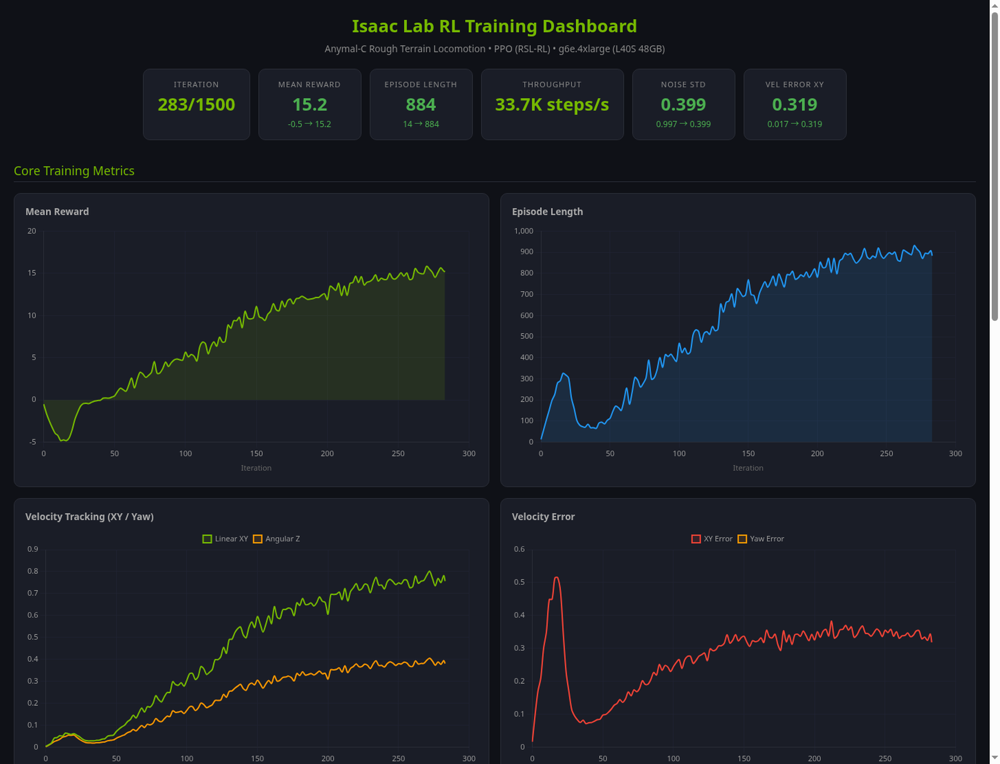
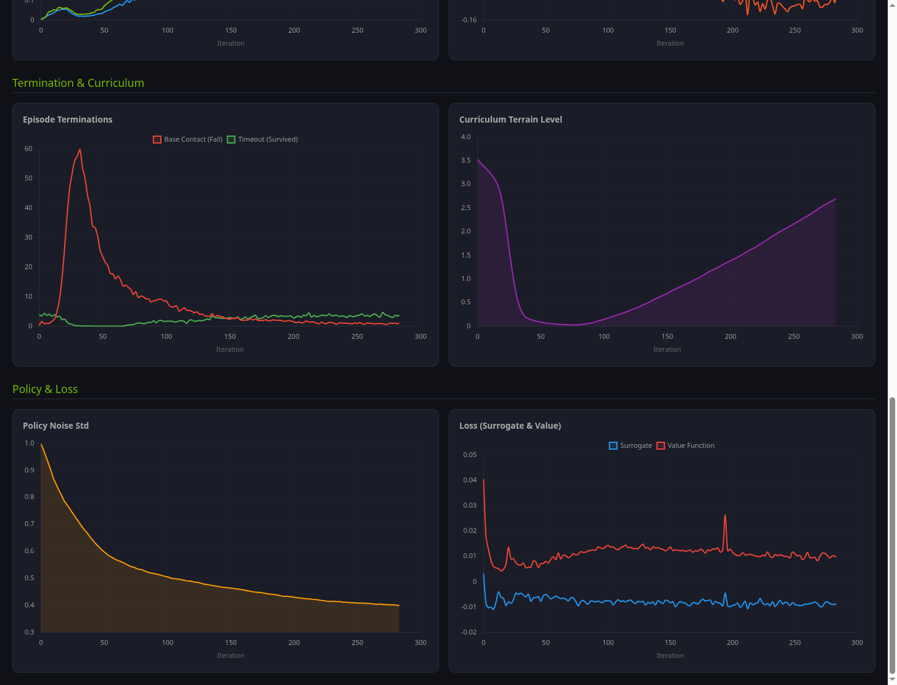
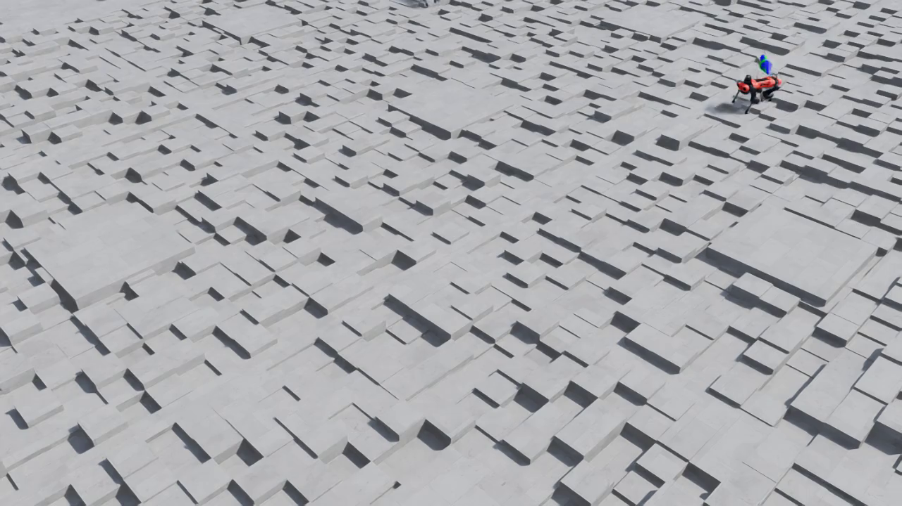

# Physical AI on AWS — 4족 보행 로봇 강화학습 워크샵

> **Isaac Lab + PPO**로 ANYmal-C 로봇이 거친 지형에서 걷는 법을 학습하는 전체 과정을 담았습니다.
> Terraform 한 줄로 AWS GPU 인프라를 구축하고, 75분 만에 1.47억 timestep을 학습합니다.

[](https://youtu.be/k98MgurW9y0)

*학습된 ANYmal-C가 울퉁불퉁한 블록 지형 위를 안정적으로 보행하는 모습 (Play 모드 캡처)*

---

## 하이라이트

| 항목 | 결과 |
|------|------|
| **로봇** | ANYmal-C 4족 보행 (12 관절) |
| **환경** | Rough Terrain (바위, 경사면, 계단) |
| **알고리즘** | PPO (Proximal Policy Optimization) |
| **병렬 환경 수** | 4,096개 동시 시뮬레이션 |
| **훈련 시간** | 75분 / 1,500 iterations |
| **최종 보상** | -0.50 → **+16.29** |
| **에피소드 길이** | 13 steps → **897 steps** (×66배) |
| **지형 난이도** | Level 5.9 / 6.25 도달 |
| **총 비용** | **~$12 (₩16,000)** |
| **산출물** | MP4 비디오 + JIT/ONNX 정책 (sim-to-real) |

---

## 프로젝트 구조

```
pai-sim-isaaclab/
│
├── main.tf                    # Terraform: VPC, EC2, EBS, IAM, CloudWatch
├── variables.tf               # 입력 변수 정의
├── outputs.tf                 # 출력 (IP, SSH 명령어)
├── terraform.tfvars.example   # 변수 예제 (복사해서 사용)
├── user_data.sh               # EC2 부팅 스크립트 (Docker, Isaac Lab 자동 설치)
│
├── REPORT_Physical_AI_on_AWS.md   # 종합 실습 리포트
├── isaac_lab_dashboard.html       # 훈련 메트릭 대시보드 (Chart.js)
│
├── images/                    # 스크린샷 & 프레임 캡처
│   ├── dashboard_screenshot*.png  # 훈련 대시보드 캡처 (3장)
│   ├── play30_frame_*.png         # Play 모드 프레임 (7장)
│   └── play_frame_*.png           # 초기 Play 프레임 (5장)
│
├── models/                    # 학습된 정책 모델
│   ├── policy_jit.pt              # TorchScript JIT (C++ 추론용)
│   └── policy.onnx                # ONNX (TensorRT/Jetson용)
│
├── videos/                    # Play 모드 녹화 영상
│   ├── anymal_c_play.mp4          # 10초 테스트 영상
│   └── anymal_c_play_30s.mp4      # 30초 최종 영상
│
└── workshop/                  # GitBook 포맷 워크샵 (7 Lab + 3 Appendix)
    ├── README.md
    ├── SUMMARY.md
    ├── book.json
    ├── assets/                # 스크린샷, 프레임 캡처
    └── chapters/
        ├── 01-concepts.md             # Physical AI 핵심 개념
        ├── 02-infrastructure.md       # AWS GPU 인프라 구축
        ├── 03-docker-build.md         # Isaac Lab Docker 빌드
        ├── 04-training.md             # PPO 강화학습 훈련
        ├── 05-results.md              # 학습 결과 분석
        ├── 06-play-mode.md            # Play 모드 & Policy Export
        ├── 07-cleanup.md              # 정리 & 다음 단계
        ├── appendix-a-troubleshooting.md  # 실전 트러블슈팅 12선
        ├── appendix-b-cost.md             # 비용 분석 & 최적화
        └── appendix-c-references.md       # SW 버전, 논문, 용어
```

---

## 아키텍처

```
┌─────────────────────────────────────────────────────────────────┐
│ AWS Cloud (ap-northeast-2 Seoul)                                │
│                                                                  │
│  ┌────────────────────────────────────────────────────────────┐ │
│  │ VPC 10.0.0.0/16                                            │ │
│  │                                                            │ │
│  │  ┌─────────────────────────────────────────────────────┐  │ │
│  │  │ EC2: g6e.4xlarge                                     │  │ │
│  │  │                                                      │  │ │
│  │  │  GPU: NVIDIA L40S (48 GB VRAM)                      │  │ │
│  │  │  CPU: AMD EPYC 7R13 (16 vCPU, 128 GiB RAM)         │  │ │
│  │  │                                                      │  │ │
│  │  │  ┌────────────────────────────────────────────┐     │  │ │
│  │  │  │ Docker: isaac-lab-ready:latest (26.8 GB)   │     │  │ │
│  │  │  │  Isaac Sim 4.5.0 + Isaac Lab v2.1.0        │     │  │ │
│  │  │  │  RSL-RL (PPO) + PyTorch 2.5.1              │     │  │ │
│  │  │  └────────────────────────────────────────────┘     │  │ │
│  │  │                                                      │  │ │
│  │  │  /      : 300 GB gp3 (OS + Docker images)          │  │ │
│  │  │  /data  : 500 GB gp3 (Checkpoints + Datasets)      │  │ │
│  │  │  /scratch: NVMe instance store (Shader cache)       │  │ │
│  │  └─────────────────────────────────────────────────────┘  │ │
│  │                          │                                 │ │
│  │                          ▼ (30분 자동 동기화)               │ │
│  │                 ┌─────────────────┐                        │ │
│  │                 │  S3 Checkpoint  │                        │ │
│  │                 └─────────────────┘                        │ │
│  └────────────────────────────────────────────────────────────┘ │
│                                                                  │
│  CloudWatch: GPU idle 30분 → EC2 자동 Stop (비용 절약)          │
└─────────────────────────────────────────────────────────────────┘
```

---

## 빠른 시작

### 사전 요구 사항

- [Terraform](https://developer.hashicorp.com/terraform/install) >= 1.5
- AWS CLI 구성 (`aws configure`)
- [NVIDIA NGC](https://ngc.nvidia.com/) API Key
- g6e 인스턴스 서비스 한도 승인 ([Service Quotas](https://console.aws.amazon.com/servicequotas/))

### 1. 인프라 배포

```bash
# 변수 파일 생성
cp terraform.tfvars.example terraform.tfvars
# terraform.tfvars 편집 — NGC API Key, SSH 키, 리전 등

# 배포 (~3분)
terraform init
terraform plan
terraform apply
```

### 2. SSH 접속 & 부팅 확인

```bash
ssh -i your-key.pem ubuntu@$(terraform output -raw public_ip)

# 부팅 스크립트 진행 확인 (15-25분 소요)
tail -f /var/log/isaac-lab-setup.log
# "Isaac Lab setup COMPLETE" 메시지 확인
```

### 3. Isaac Lab Docker 이미지 완성

`user_data.sh`가 Isaac Sim pull + Isaac Lab 빌드를 자동 수행합니다.
단, **코어 `isaaclab` 패키지 수동 설치**가 필요합니다:

```bash
docker run --name setup --gpus all \
  -e "ACCEPT_EULA=Y" -e "PRIVACY_CONSENT=Y" \
  --entrypoint bash isaac-lab-base:latest -c '
    /workspace/isaaclab/_isaac_sim/python.sh -m pip install \
      --no-build-isolation -e /workspace/isaaclab/source/isaaclab
    cd /workspace/isaaclab && ./isaaclab.sh -i rsl_rl
  '
docker commit setup isaac-lab-ready:latest
docker rm setup
```

> **왜?** `docker compose --profile base build`는 extension 패키지만 설치하고 코어 `isaaclab` 패키지를 누락합니다. 이 단계 없이는 `ModuleNotFoundError: No module named 'isaaclab'`이 발생합니다.

### 4. 훈련 실행

```bash
docker run --rm --gpus all --network=host \
  --entrypoint /workspace/isaaclab/isaaclab.sh \
  -e "ACCEPT_EULA=Y" -e "PRIVACY_CONSENT=Y" \
  -v "/scratch/isaac-sim-cache/kit:/isaac-sim/kit/cache:rw" \
  -v "/data/checkpoints:/workspace/isaaclab/logs:rw" \
  isaac-lab-ready:latest \
  -p scripts/reinforcement_learning/rsl_rl/train.py \
    --task Isaac-Velocity-Rough-Anymal-C-v0 \
    --headless
```

> **중요**: `--entrypoint` 오버라이드 필수! 기본 entrypoint(`runheadless.sh`)는 스트리밍 서버 모드입니다.

### 5. Play 모드 (학습된 정책 시각화)

```bash
docker run --rm --gpus all --network=host \
  --entrypoint /workspace/isaaclab/isaaclab.sh \
  -e "ACCEPT_EULA=Y" -e "PRIVACY_CONSENT=Y" \
  -v "/scratch/isaac-sim-cache/kit:/isaac-sim/kit/cache:rw" \
  -v "/data/checkpoints:/workspace/isaaclab/logs:rw" \
  isaac-lab-ready:latest \
  -p scripts/reinforcement_learning/rsl_rl/play.py \
    --task Isaac-Velocity-Rough-Anymal-C-v0 \
    --headless --video --video_length 1500 --num_envs 16 \
    --load_run <TIMESTAMP_DIR>
```

산출물:
- `rl-video-step-0.mp4` — 보행 비디오 (30초, 1280×720)
- `exported/policy.pt` — TorchScript JIT (C++ 실시간 추론)
- `exported/policy.onnx` — ONNX (TensorRT/Jetson 배포)

### 6. 정리

```bash
terraform destroy   # 모든 AWS 리소스 일괄 삭제
```

---

## 훈련 결과

### 학습 곡선

| Phase | Iterations | Mean Reward | 설명 |
|-------|-----------|-------------|------|
| 탐색기 | 0-40 | -0.5 → -4.9 | 랜덤 탐색, 패널티 활성화 |
| 기초 학습 | 40-120 | -4.9 → +5.0 | 보행 패턴 습득, 보상 0 돌파 |
| 정교화 | 120-300 | +5.0 → +15.0 | 안정적 보행, 속도 추적 향상 |
| 수렴 | 300-1500 | +15.0 → +16.3 | 정책 수렴, 지형 난이도 상승 |

### 대시보드






### Play 모드

[](https://youtu.be/k98MgurW9y0)
[](https://youtu.be/k98MgurW9y0)
[](https://youtu.be/k98MgurW9y0)

---

## 실전 트러블슈팅 12선

이 프로젝트에서 실제로 겪은 12가지 함정입니다. 공식 문서에 없는 실전 지식:

| # | 함정 | 심각도 | 핵심 해결법 |
|---|------|--------|------------|
| 1 | dpkg lock 경합 | 🟡 | `systemctl stop unattended-upgrades` + `DPkg::Lock::Timeout=120` |
| 2 | EBS 디바이스 이름 (Nitro) | 🟡 | `/dev/nvme*n1` 동적 탐색 (xvdf 아님) |
| 3 | Instance store 이미 마운트 | 🟡 | `/opt/dlami/nvme` 재활용 |
| 4 | Terraform templatefile 충돌 | 🟡 | `$${VAR}` double dollar 이스케이프 |
| 5 | user_data 재실행 안 됨 | 🟢 | `terraform taint` → 인스턴스 재생성 |
| 6 | Isaac Lab NGC 이미지 없음 | 🔴 | 소스에서 `docker compose --profile base build` |
| **7** | **코어 isaaclab 패키지 누락** | **🔴** | **`pip install --no-build-isolation -e source/isaaclab`** |
| 8 | Docker entrypoint 스트리밍 모드 | 🔴 | `--entrypoint /workspace/isaaclab/isaaclab.sh` |
| 9 | 훈련 스크립트 경로 변경 (v2.1.0) | 🟡 | `scripts/reinforcement_learning/rsl_rl/train.py` |
| 10 | setuptools 빌드 격리 | 🔴 | `--no-build-isolation` 플래그 |
| 11 | Volume mount → editable install 파괴 | 🟡 | 소스 디렉토리 마운트 금지 |
| 12 | 셰이더 캐시 첫 실행 4분 지연 | 🟢 | 캐시 볼륨 마운트 + 인내심 |

> 자세한 내용은 [workshop/chapters/appendix-a-troubleshooting.md](workshop/chapters/appendix-a-troubleshooting.md) 참조

---

## 비용

| 시나리오 | 인스턴스 | 리전 | 예상 비용 |
|---------|---------|------|----------|
| **이번 실습** | g6e.4xlarge On-Demand | Seoul | **~$12** |
| 비용 최적화 | g6e.4xlarge Spot | Virginia | ~$2.50 |
| 대규모 | g6e.12xlarge Spot | Virginia | ~$8 |

**비용 절약 기능:**
- GPU idle 30분 → CloudWatch 자동 Stop
- S3 체크포인트 자동 동기화 (Spot 중단 대비)

---

## 워크샵

GitBook 포맷의 단계별 워크샵이 `workshop/` 디렉토리에 포함되어 있습니다:

```bash
cd workshop
npm install honkit
npx honkit serve
# http://localhost:4000 에서 확인
```

| Lab | 내용 | 소요 시간 |
|-----|------|----------|
| Lab 1 | Physical AI 핵심 개념 | 10분 |
| Lab 2 | Terraform AWS GPU 인프라 구축 | 20분 |
| Lab 3 | Isaac Lab Docker 이미지 빌드 | 30분 |
| Lab 4 | PPO 강화학습 훈련 | 75분 |
| Lab 5 | 학습 결과 분석 | 15분 |
| Lab 6 | Play 모드 & Policy Export | 10분 |
| Lab 7 | 정리 & 다음 단계 | 10분 |
| Appendix A | 실전 트러블슈팅 12선 | — |
| Appendix B | 비용 분석 & 최적화 | — |
| Appendix C | SW 버전, 논문, 용어 사전 | — |

---

## 소프트웨어 버전

| 소프트웨어 | 버전 |
|-----------|------|
| Ubuntu | 22.04 LTS |
| NVIDIA Driver | 580.126.09 |
| Isaac Sim | 4.5.0 |
| Isaac Lab | v2.1.0 |
| PyTorch | 2.5.1 |
| RSL-RL | 2.x |
| Terraform | >= 1.5 |

---

## 라이선스

이 프로젝트의 Terraform 코드와 워크샵 문서는 MIT License로 공개됩니다.
Isaac Sim / Isaac Lab은 [NVIDIA EULA](https://docs.omniverse.nvidia.com/isaacsim/latest/common/NVIDIA_Omniverse_License_Agreement.html)를 따릅니다.

---

> **이 프로젝트는 2026년 4월 실제 AWS 배포 경험을 기반으로 작성되었습니다.**
> 총 비용 약 ₩16,000으로 4족 보행 로봇의 강화학습을 처음부터 끝까지 완료했습니다.
