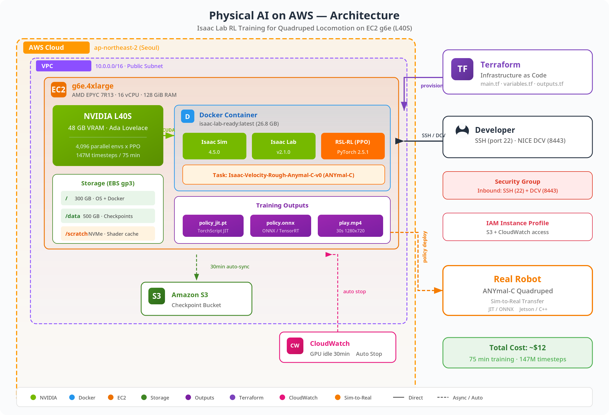

# Physical AI Workshop: Train a Walking Robot on AWS for $12

## End-to-end quadruped locomotion RL with Isaac Lab on AWS

*Isaac Lab에서 학습된 ANYmal-C가 거친 블록 지형을 안정적으로 보행하는 모습*

---

## 이 워크샵에서 배우는 것

| 단계 | 내용 | 소요 시간 |
|------|------|-----------|
| <b>Lab 1</b> | Physical AI 핵심 개념 이해 | 10분 (읽기) |
| <b>Lab 2</b> | Terraform으로 AWS GPU 인프라 구축 | 20분 |
| <b>Lab 3</b> | Isaac Sim/Lab Docker 이미지 빌드 | 30분 |
| <b>Lab 4</b> | PPO 강화학습으로 4족 보행 훈련 | 75분 (대기) |
| <b>Lab 5</b> | 학습 결과 분석 및 시각화 | 15분 |
| <b>Lab 6</b> | Play 모드 — 학습된 정책 시각화 & Export | 10분 |
| <b>Lab 7</b> | 정리 및 다음 단계 | 10분 |

<b>총 소요</b>: 약 3시간 (대부분 훈련 대기 시간)
<b>총 비용</b>: 약 <b>$12 (₩16,000)</b>

---

## 사전 요구 사항

### 필수

- [x] AWS 계정 (GPU 인스턴스 서비스 한도 승인 필요)
- [x] [Terraform](https://developer.hashicorp.com/terraform/install) v1.5 이상 설치
- [x] [NVIDIA NGC](https://ngc.nvidia.com/) 계정 + API Key
- [x] SSH 클라이언트 (OpenSSH, PuTTY 등)

### 권장

- [x] Docker 기초 지식
- [x] Linux 명령어 기초
- [x] Python 기초 (보상 함수 이해에 도움)

> ℹ️ <b>INFO</b>
>
> <b>GPU 서비스 한도 승인</b>: AWS 신규 계정은 g6e 인스턴스 한도가 0입니다. [Service Quotas 콘솔](https://console.aws.amazon.com/servicequotas/)에서 `Running On-Demand G and VT instances` 한도 증가를 요청하세요 (16 vCPU 이상). 승인에 1-3 영업일 소요될 수 있습니다.

---

## 전체 아키텍처

---

## 이 워크샵의 특징

> ✅ <b>SUCCESS</b>
>
> <b>실전 기반</b>: 이 워크샵은 2026년 4월 실제 AWS 배포에서 겪은 <b>12가지 함정과 해결법</b>을 포함합니다. 공식 문서에 없는 실전 지식을 담았습니다.

> ⚠️ <b>WARNING</b>
>
> <b>비용 주의</b>: 워크샵 완료 후 반드시 `terraform destroy`로 리소스를 삭제하세요. g6e.4xlarge는 시간당 ~$3 과금됩니다.

---

## 시작하기

👉 [Lab 1: Physical AI 핵심 개념](chapters/01-concepts.md)으로 이동하세요.
