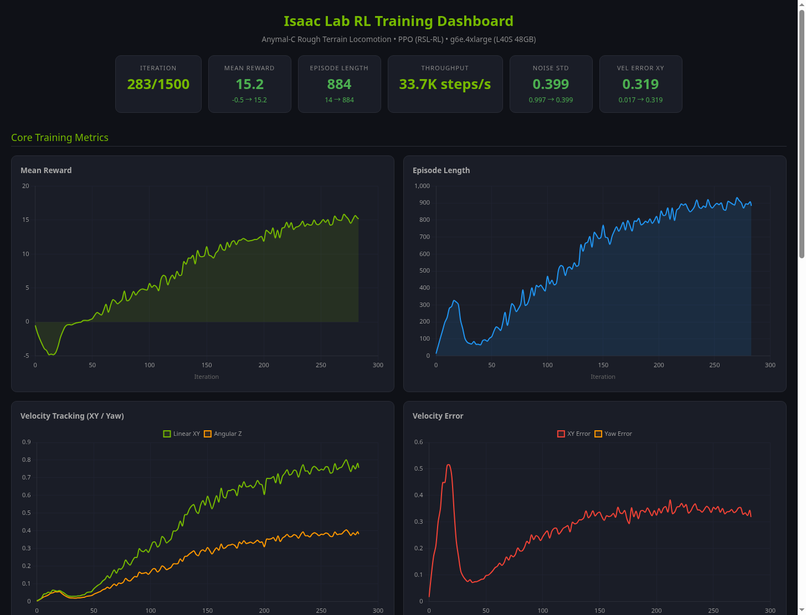
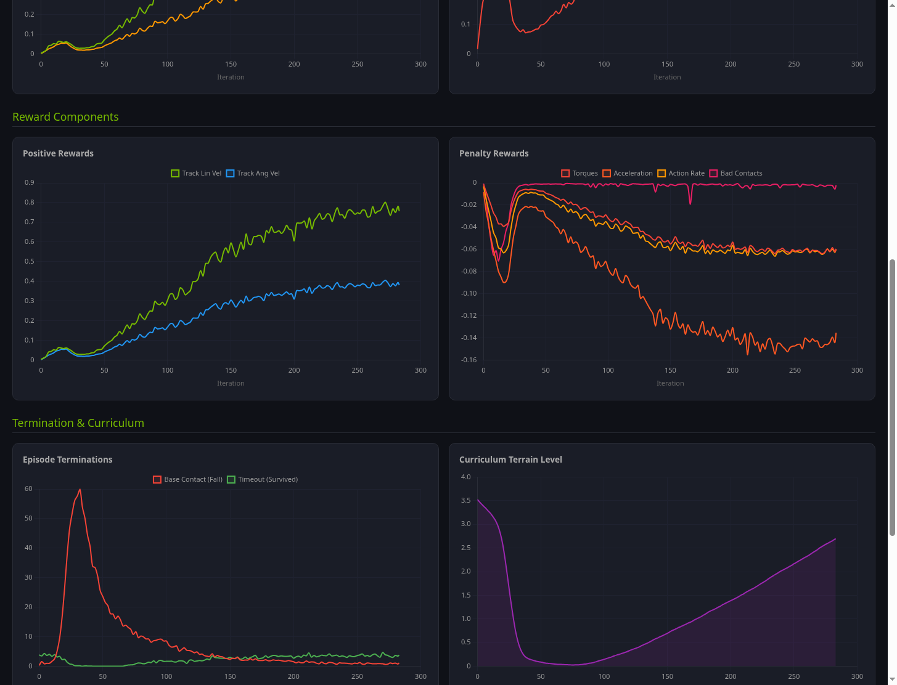
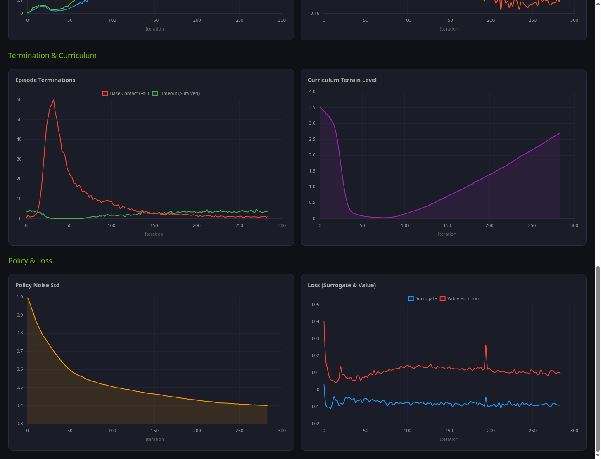

# Lab 5: 학습 결과 분석

> ℹ️ **INFO**
>
> **소요 시간**: 약 15분
> **목표**: TensorBoard 데이터를 분석하여 학습 성과를 정량적으로 평가합니다.

---

## 5.1 훈련 결과 요약

| 항목 | 값 |
|------|-----|
| 총 Iteration | **1,500** |
| 총 Timesteps | **147,456,000** (1.47억 스텝) |
| 훈련 시간 | **75분** |
| 동시 환경 수 | 4,096 |
| 처리 속도 | ~33,000 steps/sec |
| GPU 사용률 | 68-84% |
| VRAM 사용량 | 10.4 GB / 48 GB |
| 체크포인트 수 | 31개 (50 iter 간격) |
| 최종 모델 크기 | 6.6 MB |

---

## 5.2 핵심 지표 변화

| 지표 | 시작 (iter 0) | 최종 (iter 1500) | 변화 | 의미 |
|------|:---:|:---:|:---:|------|
| **Mean Reward** | -0.50 | **+16.29** | +16.79 | 학습 성공 |
| **Episode Length** | 13.6 steps | **897 steps** | ×66배 | 0.2초→13.5초 생존 |
| **Track Lin Vel XY** | 0.004 | **0.785** | ×218배 | 직선 속도 78.5% 정확 |
| **Track Ang Vel Z** | 0.002 | **0.400** | ×190배 | 회전 40% 정확 |
| **Terrain Level** | 3.53 | **5.90** | +2.37 | 고난이도 지형 도달 |
| **Noise Std** | 0.997 | **0.393** | -61% | 탐색→활용 전환 |
| **Throughput** | 19,537 | **33,014** fps | +69% | JIT 최적화 효과 |

---

## 5.3 학습 곡선 해석

### Phase 1: 탐색기 (iter 0-40)

```
Reward:  -0.5 → -4.9 (급격히 하락)
Episode: 13 → 100
```

- 신경망이 랜덤 행동을 시도하며 환경을 탐색
- **보상이 떨어지는 것은 정상** — 패널티 항목들이 활성화되기 시작
- 로봇이 "더 오래 움직이려다 더 많이 넘어지는" 단계

### Phase 2: 기초 학습 (iter 40-120)

```
Reward:  -4.9 → +5.0
Episode: 100 → 400
```

- 보상이 **0을 돌파** — 로봇이 의미 있는 보행 패턴 습득
- "넘어지지 않기"를 학습하고, 명령 속도 추적 시작
- 커리큘럼이 쉬운 지형에서 재훈련 (Terrain Level 리셋)

### Phase 3: 정교화 (iter 120-300)

```
Reward:  +5.0 → +15.0
Episode: 400 → 900
```

- 보행이 안정화되며 에피소드가 급격히 길어짐
- 속도 추적 정확도 빠르게 향상 (Lin Vel: 0.1 → 0.7)
- 커리큘럼 지형 난이도 재상승 (Level 0 → 3)

### Phase 4: 수렴 (iter 300-1500)

```
Reward:  +15.0 → +16.3 (수렴 중)
Episode: 900 (안정)
Terrain: 3 → 5.9
```

- 보상 증가가 완만해짐 — 정책이 거의 수렴
- 지형 난이도만 계속 상승 (최대 6.25까지 도달)
- Noise std 0.39로 안정 — 탐색이 줄고 확신 있는 행동

---

## 5.4 보상 구성 요소 분석

최종 보상 **+16.29**의 내역:

```
(+) 속도 추적 보상
    track_lin_vel_xy:    +0.785    (78.5% 정확)
    track_ang_vel_z:     +0.400    (40.0% 정확)

(-) 움직임 패널티
    dof_acc_l2:          -0.132    (급가속 — 가장 큰 패널티)
    action_rate_l2:      -0.061    (떨림)
    dof_torques_l2:      -0.060    (에너지 낭비)
    ang_vel_xy_l2:       -0.052    (몸통 흔들림)
    lin_vel_z_l2:        -0.035    (수직 튐)
    feet_air_time:       -0.008    (보행 리듬)
    undesired_contacts:  -0.007    (나쁜 접촉)
```

> ℹ️ **INFO**
>
> **`dof_acc_l2`가 가장 큰 패널티인 것은 정상입니다.** 거친 지형에서 균형을 잡으려면 관절을 빠르게 조절해야 하므로, 어느 정도의 관절 가속도는 불가피합니다.

---

## 5.5 TensorBoard 데이터 추출

TensorBoard 이벤트 파일에서 직접 데이터를 추출할 수 있습니다:

```python
from tensorboard.backend.event_processing.event_accumulator import EventAccumulator

log_dir = "/data/checkpoints/rsl_rl/anymal_c_rough/2026-04-04_17-08-39"
ea = EventAccumulator(log_dir)
ea.Reload()

# 사용 가능한 메트릭 목록
print(ea.Tags()['scalars'])

# Mean Reward 추출
rewards = ea.Scalars('Episode/mean_reward')
for r in rewards[-5:]:
    print(f"Step {r.step}: Reward = {r.value:.2f}")
```

---

## 5.6 훈련 대시보드



*Mean Reward와 Episode Length 변화 — 보상이 0을 돌파하는 순간이 학습 성공의 분기점*



*보상 구성 요소 — 양의 보상(속도 추적)이 음의 패널티를 능가하면서 전체 보상 상승*



*Policy Noise Std 감소와 Loss 수렴 — 에이전트가 탐색에서 활용으로 전환*

---

## 5.7 체크포인트 파일 구조

```
/data/checkpoints/rsl_rl/anymal_c_rough/2026-04-04_17-08-39/
├── model_0.pt              # 초기 (랜덤) 정책
├── model_50.pt             # 50 iteration 후
├── ...                     # 50 간격으로 저장
├── model_1499.pt           # ★ 최종 학습된 정책 (6.6 MB)
├── params/
│   ├── agent.yaml          # RL 하이퍼파라미터
│   ├── env.yaml            # 환경 설정
│   ├── agent.pkl           # 직렬화된 에이전트
│   └── env.pkl             # 직렬화된 환경
└── events.out.tfevents.*   # TensorBoard 로그 (2.6 MB)
```

---

## 체크포인트

- [ ] 4가지 학습 Phase를 이해
- [ ] 보상 구성 요소의 역할을 이해
- [ ] 커리큘럼 학습의 Terrain Level 변화를 확인
- [ ] Noise Std 감소 = 탐색→활용 전환 이해

---

👈 [Lab 4: 강화학습 훈련 실행](04-training.md)
👉 [Lab 6: Play 모드 & Policy Export](06-play-mode.md)
