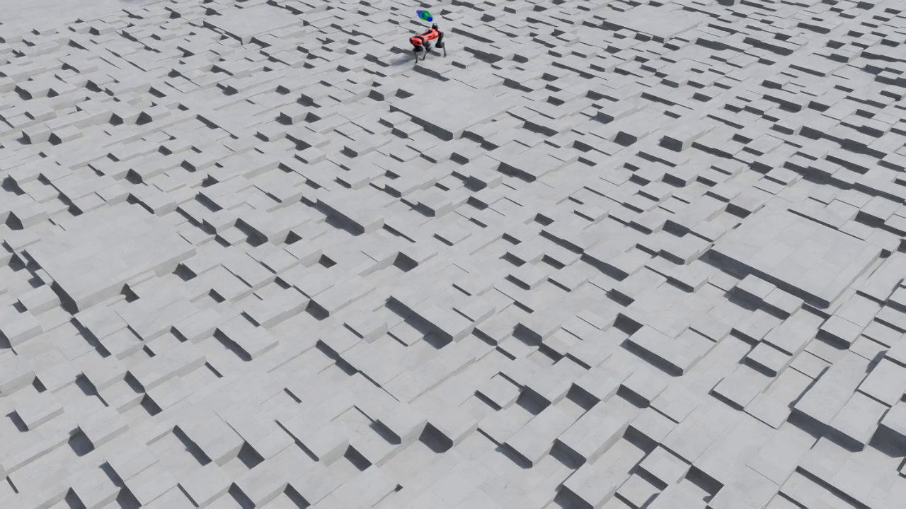

# Lab 6: Play 모드 & Policy Export

> ℹ️ INFO
>
> 소요 시간: 약 10분 목표: 학습된 정책을 시각화하고, 실제 로봇 배포용 형태(JIT/ONNX)로 export합니다.

***

## 6.1 Play 모드란?

Play 모드는 학습된 정책(신경망)을 로드하여 로봇이 실제로 어떻게 움직이는지 확인하는 추론(inference) 모드입니다.

```
훈련(train.py)                    추론(play.py)
━━━━━━━━━━━━━━                    ━━━━━━━━━━━━━━
gradient 업데이트 O                gradient 업데이트 X
탐색 노이즈 O                     탐색 노이즈 X (결정적)
4096 환경 (학습 효율)              16 환경 (시각화용)
체크포인트 저장                     비디오 녹화 + 정책 Export
```

***

## 6.2 Play 실행 (비디오 녹화)

```bash
ISAAC_SIM_CACHE="/scratch/isaac-sim-cache"

docker run --rm --gpus all --network=host \
  --entrypoint /workspace/isaaclab/isaaclab.sh \
  -e "ACCEPT_EULA=Y" -e "PRIVACY_CONSENT=Y" \
  -v "$ISAAC_SIM_CACHE/kit:/isaac-sim/kit/cache:rw" \
  -v "$ISAAC_SIM_CACHE/ov:/root/.cache/ov:rw" \
  -v "$ISAAC_SIM_CACHE/pip:/root/.cache/pip:rw" \
  -v "$ISAAC_SIM_CACHE/glcache:/root/.cache/nvidia/GLCache:rw" \
  -v "$ISAAC_SIM_CACHE/computecache:/root/.nv/ComputeCache:rw" \
  -v "/data/checkpoints:/workspace/isaaclab/logs:rw" \
  isaac-lab-ready:latest \
  -p scripts/reinforcement_learning/rsl_rl/play.py \
    --task Isaac-Velocity-Rough-Anymal-C-v0 \
    --headless \
    --video \
    --video_length 1500 \
    --num_envs 16 \
    --load_run 2026-04-04_17-08-39
```

### 주요 인자

| 인자               | 값      | 설명                      |
| ---------------- | ------ | ----------------------- |
| `--video`        | (flag) | MP4 비디오 녹화 활성화          |
| `--video_length` | 1500   | 녹화할 프레임 수 (50fps × 30초) |
| `--num_envs`     | 16     | 시각화용 소수 환경              |
| `--load_run`     | 날짜 폴더명 | 체크포인트 디렉토리 지정           |

> ⚠️ WARNING
>
> `--checkpoint`은 사용하지 마세요. `play.py`의 `--checkpoint` 인자는 `retrieve_file_path()`를 통해 해석되어, 파일명만 전달하면 `FileNotFoundError`가 발생합니다. `--load_run`만 사용하면 자동으로 최신 체크포인트를 찾습니다.

***

## 6.3 실행 과정

```
시간       이벤트
─────────────────────────────────────────
0:00       Isaac Sim 초기화 (Vulkan, L40S 감지)
0:00-0:30  셰이더 컴파일 (캐시 있으면 스킵)
0:30-1:00  환경 로드 (Anymal-C, Rough Terrain)
1:00-1:10  체크포인트 로드 + Policy Export
1:10-6:00  렌더링 + 비디오 녹화 (1500 프레임)
6:00-6:30  비디오 인코딩 + 종료
```

***

## 6.4 산출물

Play 모드는 3가지 산출물을 생성합니다:

### 1. 비디오 (MP4)

```bash
ls -lh /data/checkpoints/rsl_rl/anymal_c_rough/*/videos/play/
# rl-video-step-0.mp4  ~2.8 MB (1280×720, 50fps, 30초)
```


_5초: ANYmal-C가 rough terrain 블록 지형 위를 안정적으로 보행_


_15초: 에피소드 리셋 후 새 위치에서 보행 재개 (2마리 로봇 동시 확인)_



_25초: 험한 블록 지형을 안정적으로 횡단 중_

### 2. JIT 정책 (TorchScript)

```bash
ls -lh /data/checkpoints/rsl_rl/anymal_c_rough/*/exported/policy.pt
# policy.pt  ~1.2 MB
```

* 용도: C++에서 직접 추론 (PyTorch 불필요)
* 활용: 실제 로봇의 온보드 컴퓨터에서 실시간 제어
* 장점: Python 인터프리터 없이 저지연 추론

```cpp
// 실제 로봇에서의 사용 예시 (C++)
torch::jit::script::Module policy = torch::jit::load("policy.pt");
auto action = policy.forward({observation}).toTensor();
robot.setJointTorques(action);
```

### 3. ONNX 정책

```bash
ls -lh /data/checkpoints/rsl_rl/anymal_c_rough/*/exported/policy.onnx
# policy.onnx  ~1.1 MB
```

* 용도: 다양한 하드웨어에서 추론 (TensorRT, ONNX Runtime)
* 활용: NVIDIA Jetson, ARM 기반 로봇 컨트롤러
* 장점: 프레임워크 무관, 최적화 도구 풍부

```python
# ONNX Runtime으로 추론
import onnxruntime as ort
session = ort.InferenceSession("policy.onnx")
action = session.run(None, {"obs": observation})[0]
```

***

## 6.5 산출물 비교

<table><thead><tr><th width="160.38671875">산출물</th><th width="97.21484375">크기</th><th>형태</th><th>실제 로봇 활용</th></tr></thead><tbody><tr><td><code>model_1499.pt</code></td><td>6.6 MB</td><td>PyTorch 체크포인트</td><td>학습 재개, fine-tuning</td></tr><tr><td><code>policy.pt</code></td><td>1.2 MB</td><td>TorchScript JIT</td><td>C++ 실시간 추론</td></tr><tr><td><code>policy.onnx</code></td><td>1.1 MB</td><td>ONNX</td><td>TensorRT/Jetson 추론</td></tr><tr><td><code>rl-video-*.mp4</code></td><td>2.8 MB</td><td>MP4 비디오</td><td>시각적 검증, 발표 자료</td></tr></tbody></table>

> ✅ SUCCESS
>
> Sim-to-Real의 핵심: `policy.pt` 또는 `policy.onnx`를 실제 ANYmal-C 로봇에 탑재하면, 시뮬레이션에서 학습한 보행 정책을 그대로 실행할 수 있습니다.

***

## 6.6 Sim-to-Real: 실제 로봇에 정책 배포하기

Export된 정책 파일은 **실제 물리 로봇의 온보드 컴퓨터**에서 실행하기 위한 것입니다. 시뮬레이션에서 학습한 "뇌"를 로봇에 이식하는 과정이 Sim-to-Real Transfer의 핵심입니다.

### 전체 파이프라인

```
[시뮬레이션 — AWS GPU 서버]              [실제 로봇 — 엣지 디바이스]

 4,096개 환경에서 PPO 훈련                  IMU + 관절 센서 (48차원)
         ↓                                         ↓
 policy.onnx (1.1 MB) ─── 전송 ───→   TensorRT 추론 엔진 (< 0.1ms)
                                                   ↓
                                          12개 관절 목표 위치 출력
                                                   ↓
                                          PD 컨트롤러 → 모터 토크
                                                   ↓
                                              로봇이 걷는다!
```

> 1.47억 timestep의 경험이 1.1 MB 파일로 압축되어 실제 로봇의 "뇌"가 됩니다.

### policy.pt 사용법 — C++ 실시간 제어

PyTorch의 TorchScript JIT 포맷은 Python 없이 C++에서 직접 추론할 수 있습니다.

```cpp
#include <torch/script.h>

int main() {
    // 1. 정책 로드 (1회)
    torch::jit::script::Module policy = torch::jit::load("policy.pt");

    // 2. 로봇 제어 루프 (50~400 Hz)
    while (running) {
        // 센서 데이터 수집 (48차원)
        // - IMU: 가속도(3) + 자이로(3) + 중력방향(3)
        // - 관절: 각도(12) + 각속도(12)
        // - 명령: 목표 속도(3)
        auto obs = get_robot_observation();  // [1, 48] 텐서

        // 신경망 추론 → 12차원 (관절 목표 위치)
        auto action = policy.forward({obs}).toTensor();

        // PD 컨트롤러가 목표 위치를 토크로 변환
        robot.setJointPositionTargets(action);
    }
}
```

적합한 경우: 연구/프로토타입, PyTorch 생태계 활용, GPU 서버에서 추론

### policy.onnx 사용법 — Jetson 배포

NVIDIA Jetson (Orin, Xavier)에서 TensorRT로 최적화하면 sub-millisecond 추론이 가능합니다.

```bash
# Step 1: ONNX → TensorRT 엔진 변환 (Jetson에서 1회 실행)
/usr/src/tensorrt/bin/trtexec \
    --onnx=policy.onnx \
    --saveEngine=policy.engine \
    --fp16    # FP16 반정밀도로 2배 빠른 추론
```

```python
# Step 2: TensorRT 엔진으로 실시간 추론
import tensorrt as trt
import pycuda.driver as cuda
import numpy as np

# 엔진 로드 (1회)
runtime = trt.Runtime(trt.Logger())
with open("policy.engine", "rb") as f:
    engine = runtime.deserialize_cuda_engine(f.read())
context = engine.create_execution_context()

# 로봇 제어 루프
while running:
    obs = get_robot_observation()       # numpy array [1, 48]
    cuda.memcpy_htod(d_input, obs)      # CPU → GPU
    context.execute_v2([d_input, d_output])
    cuda.memcpy_dtoh(action, d_output)  # GPU → CPU  (~0.1ms)
    robot.set_joint_targets(action)     # 모터 제어
```

적합한 경우: 프로덕션 배포, Jetson/ARM 디바이스, 배터리 효율 중요

### 두 포맷 비교

|         | policy.pt (JIT)          | policy.onnx → TensorRT |
| ------- | ------------------------ | ---------------------- |
| 대상 하드웨어 | PC, 서버, Jetson (PyTorch) | Jetson, ARM 엣지 디바이스    |
| 추론 속도   | \~1-2ms                  | \~0.1ms                |
| 의존성     | libtorch (\~300 MB)      | TensorRT (Jetson 내장)   |
| 정밀도     | FP32                     | FP16/INT8 선택 가능        |
| 제어 주파수  | \~200 Hz                 | \~400+ Hz              |
| 권장 용도   | 연구, 프로토타입                | 프로덕션 배포                |

> 제어 주파수가 높을수록 로봇이 더 빠르게 반응하여 안정적으로 보행할 수 있습니다. 실제 ANYmal-C는 200\~400 Hz 제어 루프를 사용합니다.

### 실제 ANYmal-C 배포 구성

```
┌─────────────────────────────────┐
│  ANYmal-C 로봇                   │
│                                  │
│  ┌──────────────────────┐       │
│  │ NVIDIA Jetson Orin   │       │
│  │                      │       │
│  │  policy.engine       │       │
│  │  (TensorRT FP16)     │       │
│  │       ↑       ↓      │       │
│  │   48차원 obs  12차원 action  │
│  └──────┬───────┬───────┘       │
│         │       │                │
│    IMU/관절   PD 컨트롤러        │
│    센서        → 12개 모터       │
└─────────────────────────────────┘

입력 (48차원):
  - 기본 각속도 (3)
  - 중력 벡터 (3)
  - 속도 명령 (3)
  - 관절 각도 (12)
  - 관절 각속도 (12)
  - 이전 행동 (12)
  - 높이 스캔 (선택)

출력 (12차원):
  - RF_HAA, RF_HFE, RF_KFE  (오른쪽 앞다리)
  - LF_HAA, LF_HFE, LF_KFE  (왼쪽 앞다리)
  - RH_HAA, RH_HFE, RH_KFE  (오른쪽 뒷다리)
  - LH_HAA, LH_HFE, LH_KFE  (왼쪽 뒷다리)
```

***

## 6.7 비디오를 로컬로 다운로드

```bash
# EC2에서 로컬로 비디오 복사
scp -i dev-ap-northeast-2.pem \
  ubuntu@<PUBLIC_IP>:/data/checkpoints/rsl_rl/anymal_c_rough/*/videos/play/rl-video-step-0.mp4 \
  ./anymal_c_play.mp4

# Export된 정책도 함께
scp -i dev-ap-northeast-2.pem \
  ubuntu@<PUBLIC_IP>:/data/checkpoints/rsl_rl/anymal_c_rough/*/exported/policy.onnx \
  ./policy.onnx
```

***

## 6.8 (선택) Nice DCV로 실시간 시각화

headless 비디오 대신 실시간으로 로봇을 보고 싶다면:

1. Security Group에 포트 8443 추가
2. Nice DCV 서버 설치 (EC2에서 무료)
3. `--headless` 플래그 제거하고 play.py 실행
4. 브라우저에서 `https://<PUBLIC_IP>:8443`으로 접속

이 방법은 실시간 인터랙션이 가능하지만, 추가 설정이 필요합니다.

***

## 체크포인트

* [ ] Play 모드로 30초 비디오 생성 완료
* [ ] 비디오에서 로봇이 rough terrain 위를 걷는 모습 확인
* [ ] `policy.pt` (JIT)과 `policy.onnx` export 파일 확인
* [ ] 각 산출물의 용도(학습 재개 vs 실제 로봇 배포)를 이해
* [ ] JIT vs ONNX/TensorRT 차이와 실제 로봇 배포 흐름을 이해

***

👈 [Lab 5: 학습 결과 분석](05-results.md) 👉 [Lab 7: 정리 및 다음 단계](07-cleanup.md)
