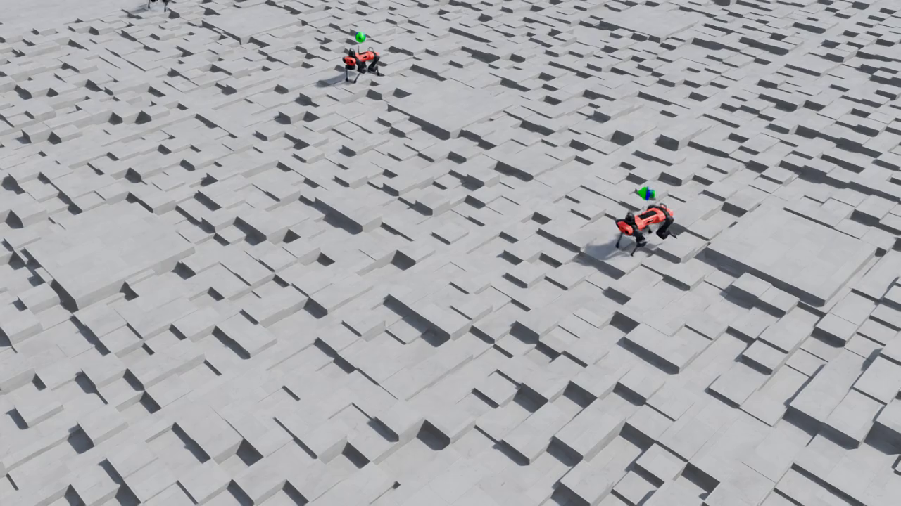

# Lab 6: Play 모드 & Policy Export

> ℹ️ **INFO**
>
> **소요 시간**: 약 10분
> **목표**: 학습된 정책을 시각화하고, 실제 로봇 배포용 형태(JIT/ONNX)로 export합니다.

---

## 6.1 Play 모드란?

**Play 모드**는 학습된 정책(신경망)을 로드하여 로봇이 실제로 어떻게 움직이는지 확인하는 추론(inference) 모드입니다.

```
훈련(train.py)                    추론(play.py)
━━━━━━━━━━━━━━                    ━━━━━━━━━━━━━━
gradient 업데이트 O                gradient 업데이트 X
탐색 노이즈 O                     탐색 노이즈 X (결정적)
4096 환경 (학습 효율)              16 환경 (시각화용)
체크포인트 저장                     비디오 녹화 + 정책 Export
```

---

## 6.2 Play 실행 (비디오 녹화)

```bash
ISAAC_SIM_CACHE="/scratch/isaac-sim-cache"

docker run --rm --gpus all --network=host \
  --entrypoint /workspace/isaaclab/isaaclab.sh \
  -e "ACCEPT_EULA=Y" -e "PRIVACY_CONSENT=Y" \
  -v "$ISAAC_SIM_CACHE/kit:/isaac-sim/kit/cache:rw" \
  -v "$ISAAC_SIM_CACHE/ov:/root/.cache/ov:rw" \
  -v "$ISAAC_SIM_CACHE/pip:/root/.cache/pip:rw" \
  -v "$ISAAC_SIM_CACHE/glcache:/root/.cache/nvidia/GLCache:rw" \
  -v "$ISAAC_SIM_CACHE/computecache:/root/.nv/ComputeCache:rw" \
  -v "/data/checkpoints:/workspace/isaaclab/logs:rw" \
  isaac-lab-ready:latest \
  -p scripts/reinforcement_learning/rsl_rl/play.py \
    --task Isaac-Velocity-Rough-Anymal-C-v0 \
    --headless \
    --video \
    --video_length 1500 \
    --num_envs 16 \
    --load_run 2026-04-04_17-08-39
```

### 주요 인자

| 인자 | 값 | 설명 |
|------|-----|------|
| `--video` | (flag) | MP4 비디오 녹화 활성화 |
| `--video_length` | 1500 | 녹화할 프레임 수 (50fps × 30초) |
| `--num_envs` | 16 | 시각화용 소수 환경 |
| `--load_run` | 날짜 폴더명 | 체크포인트 디렉토리 지정 |

> ⚠️ **WARNING**
>
> **`--checkpoint`은 사용하지 마세요.** `play.py`의 `--checkpoint` 인자는 `retrieve_file_path()`를 통해 해석되어, 파일명만 전달하면 `FileNotFoundError`가 발생합니다. `--load_run`만 사용하면 자동으로 최신 체크포인트를 찾습니다.

---

## 6.3 실행 과정

```
시간       이벤트
─────────────────────────────────────────
0:00       Isaac Sim 초기화 (Vulkan, L40S 감지)
0:00-0:30  셰이더 컴파일 (캐시 있으면 스킵)
0:30-1:00  환경 로드 (Anymal-C, Rough Terrain)
1:00-1:10  체크포인트 로드 + Policy Export
1:10-6:00  렌더링 + 비디오 녹화 (1500 프레임)
6:00-6:30  비디오 인코딩 + 종료
```

---

## 6.4 산출물

Play 모드는 3가지 산출물을 생성합니다:

### 1. 비디오 (MP4)

```bash
ls -lh /data/checkpoints/rsl_rl/anymal_c_rough/*/videos/play/
# rl-video-step-0.mp4  ~2.8 MB (1280×720, 50fps, 30초)
```


*5초: ANYmal-C가 rough terrain 블록 지형 위를 안정적으로 보행*



*15초: 에피소드 리셋 후 새 위치에서 보행 재개 (2마리 로봇 동시 확인)*


*25초: 험한 블록 지형을 안정적으로 횡단 중*

### 2. JIT 정책 (TorchScript)

```bash
ls -lh /data/checkpoints/rsl_rl/anymal_c_rough/*/exported/policy.pt
# policy.pt  ~1.2 MB
```

- **용도**: C++에서 직접 추론 (PyTorch 불필요)
- **활용**: 실제 로봇의 온보드 컴퓨터에서 실시간 제어
- **장점**: Python 인터프리터 없이 저지연 추론

```cpp
// 실제 로봇에서의 사용 예시 (C++)
torch::jit::script::Module policy = torch::jit::load("policy.pt");
auto action = policy.forward({observation}).toTensor();
robot.setJointTorques(action);
```

### 3. ONNX 정책

```bash
ls -lh /data/checkpoints/rsl_rl/anymal_c_rough/*/exported/policy.onnx
# policy.onnx  ~1.1 MB
```

- **용도**: 다양한 하드웨어에서 추론 (TensorRT, ONNX Runtime)
- **활용**: NVIDIA Jetson, ARM 기반 로봇 컨트롤러
- **장점**: 프레임워크 무관, 최적화 도구 풍부

```python
# ONNX Runtime으로 추론
import onnxruntime as ort
session = ort.InferenceSession("policy.onnx")
action = session.run(None, {"obs": observation})[0]
```

---

## 6.5 산출물 비교

| 산출물 | 크기 | 형태 | 실제 로봇 활용 |
|--------|------|------|---------------|
| `model_1499.pt` | 6.6 MB | PyTorch 체크포인트 | 학습 재개, fine-tuning |
| `policy.pt` | 1.2 MB | TorchScript JIT | C++ 실시간 추론 |
| `policy.onnx` | 1.1 MB | ONNX | TensorRT/Jetson 추론 |
| `rl-video-*.mp4` | 2.8 MB | MP4 비디오 | 시각적 검증, 발표 자료 |

> ✅ **SUCCESS**
>
> **Sim-to-Real의 핵심**: `policy.pt` 또는 `policy.onnx`를 실제 ANYmal-C 로봇에 탑재하면, 시뮬레이션에서 학습한 보행 정책을 **그대로** 실행할 수 있습니다.

---

## 6.6 비디오를 로컬로 다운로드

```bash
# EC2에서 로컬로 비디오 복사
scp -i dev-ap-northeast-2.pem \
  ubuntu@<PUBLIC_IP>:/data/checkpoints/rsl_rl/anymal_c_rough/*/videos/play/rl-video-step-0.mp4 \
  ./anymal_c_play.mp4

# Export된 정책도 함께
scp -i dev-ap-northeast-2.pem \
  ubuntu@<PUBLIC_IP>:/data/checkpoints/rsl_rl/anymal_c_rough/*/exported/policy.onnx \
  ./policy.onnx
```

---

## 6.7 (선택) Nice DCV로 실시간 시각화

headless 비디오 대신 **실시간으로** 로봇을 보고 싶다면:

1. Security Group에 포트 8443 추가
2. Nice DCV 서버 설치 (EC2에서 무료)
3. `--headless` 플래그 제거하고 play.py 실행
4. 브라우저에서 `https://<PUBLIC_IP>:8443`으로 접속

이 방법은 실시간 인터랙션이 가능하지만, 추가 설정이 필요합니다.

---

## 체크포인트

- [ ] Play 모드로 30초 비디오 생성 완료
- [ ] 비디오에서 로봇이 rough terrain 위를 걷는 모습 확인
- [ ] `policy.pt` (JIT)과 `policy.onnx` export 파일 확인
- [ ] 각 산출물의 용도(학습 재개 vs 실제 로봇 배포)를 이해

---

👈 [Lab 5: 학습 결과 분석](05-results.md)
👉 [Lab 7: 정리 및 다음 단계](07-cleanup.md)
